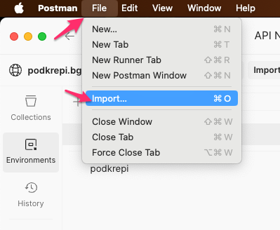
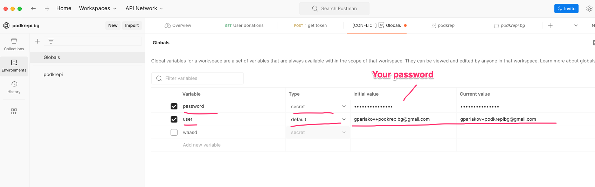
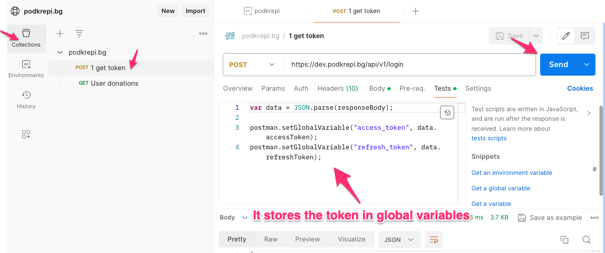
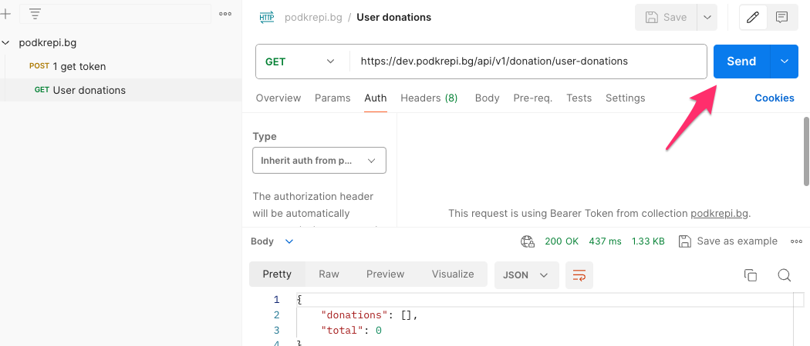
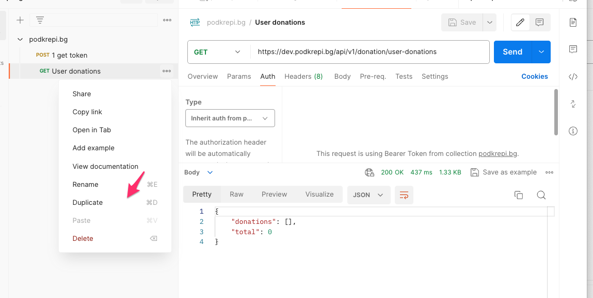
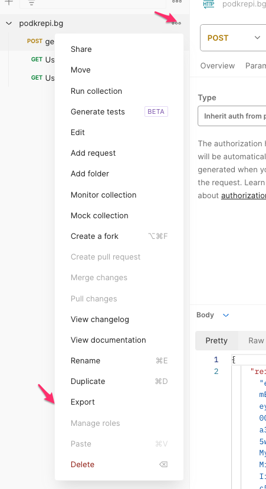

# Podkrepi.bg postman collection

## Getting started

- Get the postman app 
- Import the collection 
- Create an environment and add your username and password *ensure the password is a **secret** 
- Get the tokens via the `get token` request (it will use the postman env variables from previous step and store a access_token in postman global variables) 

Done - now you can make authenticated requests: 

## Contributing to the collection

The way to contribute is edit in a postman editor and then export it (Postman stores the collections in a db somewhere and there's no trivial way to have it store it where we need it - in the repo)

- Edit in postman 

- Export and overwrite in the repo

